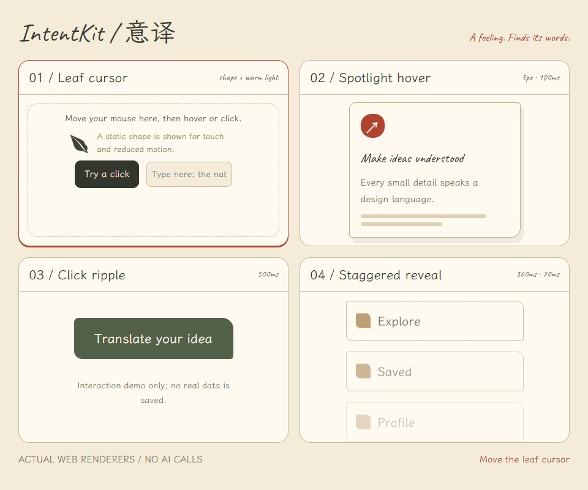
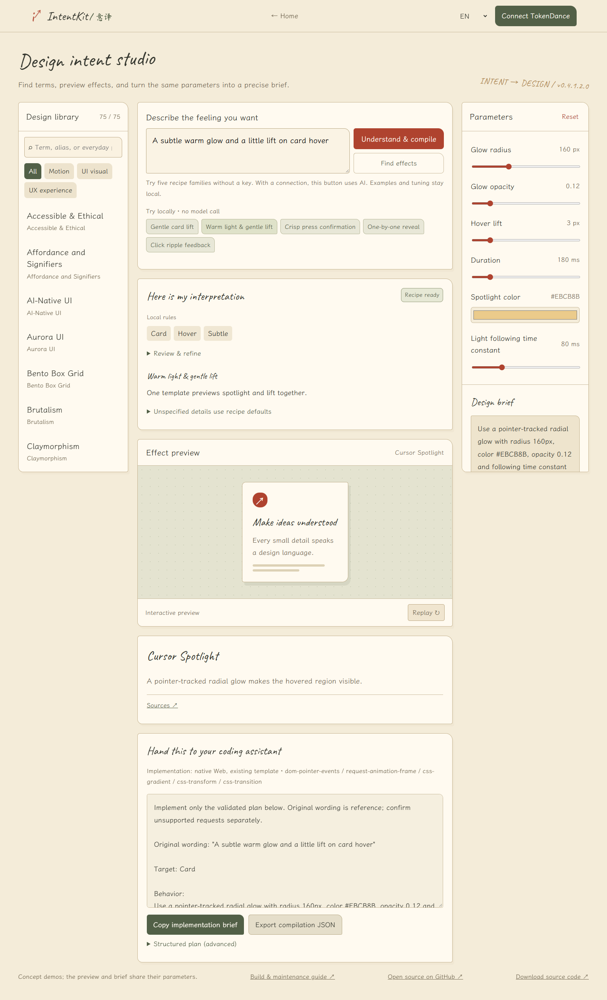

# IntentKit / 意译

[中文](README.md) · [English](README.en.md) · [日本語](README.ja.md) · [한국어](README.ko.md) · [Deutsch](README.de.md)

**Turn “I want it to feel like this” into a visible, adjustable design brief you can hand to a coding assistant.**

[Website](https://vibe-design-labs.github.io/Vibe-UI-UX/) · [Try the studio](https://vibe-design-labs.github.io/Vibe-UI-UX/studio.html) · [Changelog](CHANGELOG.md)

**v0.4.1.2.0 · 75 design entries · 75 dedicated preview templates · 5 local recipe families · MIT + OFL**

[](https://vibe-design-labs.github.io/Vibe-UI-UX/studio.html?item=custom-cursor)

Captured from the project’s actual renderers, without AI-generated frames. The GIF is a recording; the [live studio](https://vibe-design-labs.github.io/Vibe-UI-UX/studio.html) supports interaction, parameter tuning and reduced-motion preferences.

## What is IntentKit?

Describing the feeling is often the hardest part of vibe coding. Does “lighter” mean a smaller hover lift, a scale change, or more whitespace? IntentKit connects everyday expressions with UI/UX terminology, aliases, examples and concrete parameters so designers, developers and newcomers can agree on what to build.

Design Compiler follows **everyday language → editable understanding (Design IR) → controlled recipe → real preview → design brief / Agent brief / JSON**. It helps you inspect a design proposal; it does not generate full pages or execute arbitrary model-produced code.

| Feature | Available now |
| --- | --- |
| Design library | 75 searchable entries, curated aliases, definitions, usage guidance and source links |
| Effect studio | 75 corresponding templates, validated parameters, briefs, JSON export and shareable single-effect links |
| Design Compiler | 5 local recipe families: gentle lift, warm glow with lift, press feedback, staggered entry and click ripple |
| Custom cursor | 8 shapes; configurable color, size, following and click feedback, plus independent spotlight settings |
| Languages | Chinese, English, Japanese, Korean and German interface; README languages switch via the links above |
| Optional AI | Your own TokenDance connection for intent parsing and known-effect suggestions |

## First run: no key needed

1. Open the [studio](https://vibe-design-labs.github.io/Vibe-UI-UX/studio.html) and choose English in the top-right language selector.
2. Click **Try locally → Gentle card lift**, or enter `The card should lift gently on hover, not too much` and click **Understand & compile**. Without a configured key, it uses local rules.
3. Review the understanding and expand the editable fields to correct target, trigger and strength. Defaults and inferences are listed separately from your stated intent.
4. Hover over the card and adjust the parameters. Preview, brief and recipe use the same final values. If an adjustment conflicts with the intent, review the warning and explicitly accept the current parameters.
5. Copy the **Agent brief** from the compiler output into your coding assistant, or export the **compilation JSON**. The original right-hand JSON export remains a separate **single-effect export**.

For terminology lookup, search `frosted glass`, `backdrop-filter` or a known alias in the sidebar. **Every public entry has a corresponding preview.** Styles show distinct materials and layouts, motion entries show real movement, dashboards use clearly labeled synthetic data, and UX principles demonstrate tasks and states. There is no generic concept placeholder. See the [dedicated-preview contract](docs/PREVIEW_SCENES.md) (Chinese).



## Optional AI with TokenDance

1. Click **Connect TokenDance**. The panel loads the public model catalog; this does not call a model.
2. Authorize through the TokenDance popup to create a key, or paste your own existing key from [TokenDance keys](https://tokendance.space/keys). Authorization creates a key after your confirmation.
3. Choose a chat-compatible model and click **Keep in this page**. If the catalog fails to load, enter an official model ID manually.
4. With a configured key, only an explicit click on **Find effects** or **Understand & compile** requests a model; TokenDance bills usage. The five local examples remain local even when connected.
5. Use **Forget key** to disconnect. **Keys stay in page memory and clear on refresh**. There is no account system or key storage in localStorage, sessionStorage, the repository or GitHub Secrets. The language preference can be saved.

GitHub Pages connects directly from your browser to TokenDance; local/server hosting uses the current instance’s relay. Enter keys only in trusted deployments. Parsing failures fall back to local rules without automatic paid retries. Paid end-to-end testing with a real key has not been completed. See [integration details and test limits](docs/TOKENDANCE.md) (Chinese).

## Run your fork locally

Requires **Node.js 20+**; content checks and source packaging additionally use **Python 3**. There are no npm dependencies and no key is needed to start.

```sh
git clone https://github.com/Vibe-Design-Labs/Vibe-UI-UX.git
cd Vibe-UI-UX
npm run dev
```

Open [http://localhost:4173/studio.html](http://localhost:4173/studio.html). Substitute your fork’s URL when cloning. After changing source files, stop and restart the development server to rebuild.

Validate and reproduce static hosting:

```sh
npm test
npm run check:content
npm run check:docs
python scripts/package-source.py
npm run build:pages
npm run preview:pages
```

Static preview: [http://localhost:4174/Vibe-UI-UX/](http://localhost:4174/Vibe-UI-UX/). Deployable output: `dist/pages/`. Use python3 where python is unavailable. Building, checking and packaging do not call a model.

## Publish your own GitHub Pages site

1. Fork this repository and enable Actions in your fork.
2. Choose **Settings → Pages → Source → GitHub Actions**.
3. Run **Actions → Deploy GitHub Pages → Run workflow** for the first deployment.
4. After it succeeds, use the actual URL from Pages settings or the deployment output. Later pushes to main deploy automatically.

Relative paths support repository subpaths and forks. **No model key or GitHub Secret is required**: each visitor connects their own TokenDance account/key. [Full deployment guide](docs/GITHUB_PAGES.md) (Chinese).

## Maintain entries, recipes and effects

Give the [maintenance skill](skills/ui-ux-content-maintainer/SKILL.md) to any AI that can read/write files, or edit by hand. Add a JSON file in `content/items/` when using an existing template; a new renderer also requires registry and renderer changes. See [recipe maintenance](skills/ui-ux-content-maintainer/references/compiler-recipes.md).

Run `npm run check:content`, `npm test` and `npm run check:docs`; rebuild [font subsets](docs/FONTS.md), the source archive and Pages when needed. The scripts need no GPT key or model quota; another AI provider may charge for its own service. [Maintenance guide](docs/CONTENT_MAINTENANCE.md) (Chinese).

| Location | Purpose |
| --- | --- |
| `content/items/` | Entries, aliases, localized text, sources and review status |
| `previews/registry.json` + `public/previews.js` | Parameter contracts and controlled renderers |
| `compiler/` + `public/compiler-*.js` | IR, multilingual expressions, recipes, validation and compiler UI |
| `public/` | Static website, studio, translations and TokenDance connection |
| `server/worker.js` | Optional local/Worker relay; not required by GitHub Pages |
| `.github/workflows/pages.yml` | Validation, packaging, build and deployment |

## Current limits

- Most entry text is Chinese/English draft content. Japanese, Korean and German bodies explicitly fall back to English. Five interface languages do not imply five reviewed knowledge collections.
- Local rules cover five recipe families, not arbitrary design intent. Ambiguous or unsupported requests list unresolved details. Cross-template composition, springs and automatic mapping of exact numbers in sentences are not supported yet.
- Structural validation does not certify facts, sources or translations. Strict publication review intentionally fails while drafts remain. Unread WeChat article text was not fabricated as a consulted source.
- Previews illustrate concepts and do not save real data. Review exports before implementation. Reduced motion, touch and keyboard interactions are handled separately.

[Compiler structure and constraints](docs/DESIGN_COMPILER.md) · [50 new entries and source status](docs/CONTENT_EXPANSION_2026-10-07.md) · [Release checks](docs/RELEASE_0.4.1.2.0.md) · [Five-part versioning](docs/VERSIONING.md) — detailed documents are currently in Chinese.

## License and credits

Application code: [MIT](LICENSE). Ma Shan Zheng, LXGW WenKai and Caveat fonts: **SIL OFL 1.1**, with full notices and rebuild steps in [font documentation](docs/FONTS.md). README screenshots and recordings show this project’s actual interface.

Early interaction direction referenced Hyperknow; rice paper, ink, vermilion and handwritten typography followed user-provided visual references. Layout and code are original; reference-site images, trademarks and component source were not reused. Contributions with reliable sources, translations, reproducible effects and bug reports are welcome through [Issues](https://github.com/Vibe-Design-Labs/Vibe-UI-UX/issues).
