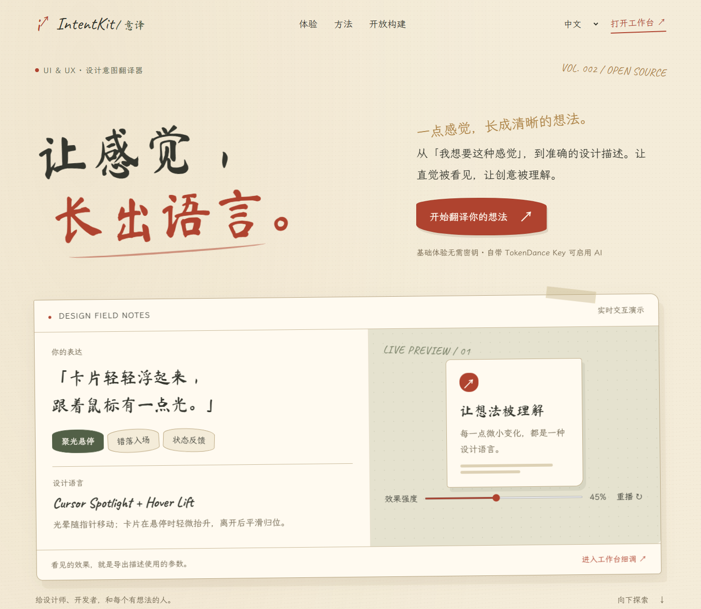

# IntentKit / 意译

把日常设计表达转成专业 UI/UX 术语、可操作演示和准确描述。v0.3 提供纸张与手写字风格的官网、工作台、24 个词条、15 个可控演示模板、五语界面和 TokenDance BYOK。

[GitHub 开源仓库](https://github.com/virtue192/Vibe-UI-UX) · [GitHub Pages / Fork 部署](docs/GITHUB_PAGES.md) · [维护新内容](docs/CONTENT_MAINTENANCE.md) · [字体与许可](docs/FONTS.md)

IntentKit translates everyday design intentions into professional UI/UX vocabulary, live previews and reusable design briefs. Bring your own TokenDance key for optional AI suggestions. The interface supports Chinese, English, Japanese, Korean and German. Basic search, previews, parameter tuning and export work without an API key. Fork-friendly static deployment on GitHub Pages is included; visitors connect directly to TokenDance from their browser with their own key. No shared model key or backend is required for Pages. Application code is MIT; bundled fonts remain under SIL OFL 1.1.

## 运行

Node.js 20+，无需 npm 依赖。Python 3 用于内容验证与源码打包。

    npm run dev
    # http://localhost:4173
    npm run build
    npm test
    npm run check:content

修改源码后重新启动本地服务以加载新构建。本地启动、浏览、预览、复制、导出与内容更新不调用模型。只有配置密钥并点击工作台“查找效果”才会产生 TokenDance 请求与可能的费用。

## 架构

- public/index.html：静态官网，米纸色、墨灰、苔绿与朱砂红；错落纸页、交互演示、滚动入场与按钮吸附。
- public/studio.html：搜索、筛选、候选比较、参数、描述与 JSON 导出。
- content/items/*.json：一词条一文件，稳定 ID、双语正文、别名、来源与审校状态。
- previews/registry.json：参数默认值、合法范围、枚举。
- public/previews.js：受控渲染器，不运行模型生成代码。
- public/core.js：最终参数校验、描述生成与候选校验；预览与导出共用。
- public/i18n.js：中文、英文、日文、韩文、德文界面；content 翻译独立维护。
- public/polish.css：纸张配色、字体、字号与响应式布局；public/fonts/ 自托管 OFL 字体。
- server/worker.js：固定 TokenDance Chat Completions 地址，单次请求中转。
- scripts/build.mjs：生成本地/Worker 模式的 dist/client 与 dist/server/index.js。
- scripts/build-pages.mjs：生成 dist/pages/，采用相对路径和浏览器直连 BYOK。
- .github/workflows/pages.yml：main 推送或手动触发时验证并自动部署 GitHub Pages。
- skills/ui-ux-content-maintainer：可交给其他 AI 使用的维护 skill 与本地检查脚本。

## 维护新内容

把维护 skill 和本 README 交给任意支持读写文件的 AI。选择已注册模板时，只需新增或编辑 content/items/*.json。新模板才需要同时更新注册表、渲染器、界面语言文案与验证。

    python skills/ui-ux-content-maintainer/scripts/validate_content.py .

内容发布审校后运行：

    python skills/ui-ux-content-maintainer/scripts/validate_content.py . --publish-check --require-locales zh-CN en

检查器不联网、不使用 API Key、不消耗 GPT 模型额度。使用其他 AI 本身可能有其服务费用。

当前词条是中英文草稿，日/韩/德正文明确英文回退。五语“界面完整”与五语“内容完整”是不同状态。严格发布检查目前应失败，避免把草稿当作已审校知识库。seed-content.py 是一次性初始作者脚本，后续维护不要重新运行，以免覆盖已编辑词条。

## 动效与可访问性

鼠标聚光通过 pointermove、requestAnimationFrame 和径向渐变实现；模板使用同一份半径、透明度、抬升距离和过渡时长。鼠标吸附仅用于官网主要操作。粗指针触摸不启动指针跟随；保留原生光标和原生控件。

尊重 prefers-reduced-motion，关闭非必要位移、扫光、装饰循环与鼠标跟随。官网提供暂停装饰动效按钮。键盘焦点可见、模态支持 Escape、候选和状态消息可操作。WebMCP 仅在 document.modelContext 存在时注册两个无模型调用的工具：search_design_terms 与 set_design_preview。

## GitHub Pages 与 fork

推荐将项目发布到自己的 GitHub Pages。完整操作见 [Pages 指南](docs/GITHUB_PAGES.md)：提交源码到 main，在 Settings → Pages 选择 GitHub Actions，然后运行 Deploy GitHub Pages 工作流。fork 后在自己的仓库完成同样的一次性设置即可；相对路径无需改用户名或仓库名前缀。后续 main 更新自动部署。

    python scripts/package-source.py
    npm run build:pages
    npm run preview:pages
    # http://localhost:4174/Vibe-UI-UX/

构建输出为 dist/pages/，只有静态 HTML/CSS/JS/JSON/字体/源码下载包。也可以将它部署到其他静态主机。源码包包含 .github 工作流，排除 .git、托管身份、环境文件、node_modules 和 dist。预期原仓库网址为 https://virtue192.github.io/Vibe-UI-UX/；实际上线以 GitHub 成功的部署任务为准。

## BYOK 隐私和限制

静态 Pages 版由浏览器直连固定 https://tokendance.space/gateway/v1/chat/completions。模型 ID 以 TokenDance 公布的列表为准。访客自己的密钥仅在当前页面内存，通过 Authorization 发送到 TokenDance，不放在仓库、构建产物或 GitHub Secrets 中。刷新或清除后丢弃，不写 localStorage/sessionStorage、数据库或日志。只有界面语言偏好会保存至 localStorage。

2026-10-04 无密钥 OPTIONS 预检验证了 TokenDance 允许跨域 POST 与 Authorization。尚未使用真实模型密钥进行付费联调；实际额度、模型可用性及未来跨域策略需实际接入时确认。网络或跨域失败时显示可理解的错误，清除密钥后可继续本地查询。

本地 npm run dev 与可选 Cloudflare Worker 版本保留同源中转方式；当前实例会接触访客的密钥，应仅在可信部署使用。静态版不依赖这个服务器。两种方式都只接受已知候选 ID、限制输入和返回大小、禁止上游重定向；模型输出作为文本显示，不执行生成的任意代码。

日常内容更新、构建、检查、GitHub Pages 部署不会调用模型，不消耗 GPT 或 TokenDance 模型额度。使用者自行选择模型并承担调用费用。

早期交互方向参考 https://www.hyperknow.io/；v0.3 根据用户提供的米纸、水墨、朱砂与手写字体参考重新设计。原创编排与代码，不使用参考站或参考图片的图片、商标、正文或组件源码。知识来源链接在各词条数据中；解释与演示为本项目原创。

## Typography & licenses

标题采用 Ma Shan Zheng 的改名 Web 子集，正文采用 LXGW WenKai 的改名 Web 子集，英文手写采用 Caveat。参考图未写明实际字体名称，不宣称与参考图为同款。字形来源、作者版权、三个完整 OFL 许可与无 AI 调用的子集重建步骤见 [字体说明](docs/FONTS.md)。新增未收录字符时，重新运行子集脚本；平时运行网站不需要安装字体制作依赖。
