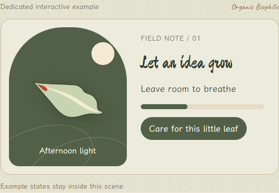
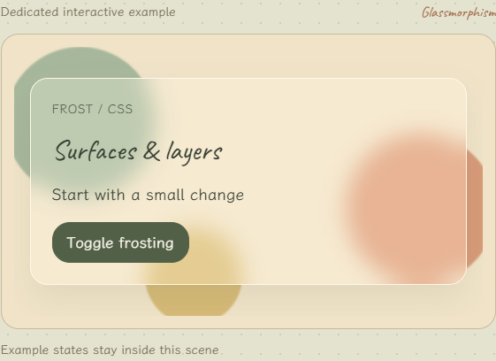
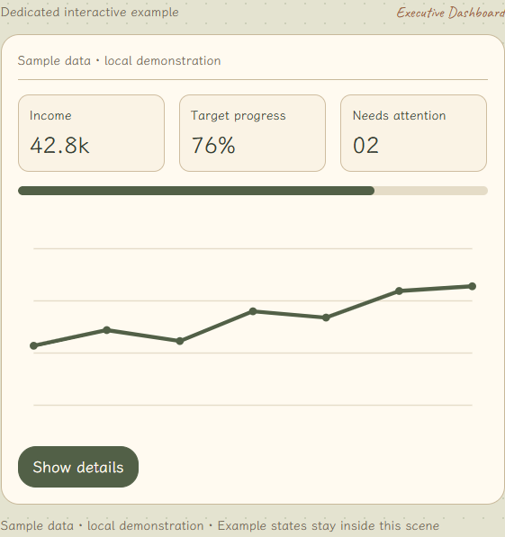

# 专属预览与维护要求 · 0.4.1.2.0

官网包含 75 个词条及 75 个对应预览。本次补齐 59 个场景，保留此前 16 个渲染器和 Compiler 的 5 个配方。不是把词条名称放到同一张占位卡上：风格、布局、看板、原则和动效有不同的材料、构图或任务结构。

## 风格与交互

整体纸色、墨绿、朱砂、手写字和叶片品牌保持一致；风格特有的深色、金属、玻璃、色块等只作用于演示区域。下面是实际浏览器渲染的截图：

## 59 个新增对应关系

每个 ID 与实际场景相同，不新增别名 ID。参数来自 previews/registry.json，控件、预览、描述和 JSON 共用最终值。

| 词条 / 场景 | 类型 | 专属画面与行为 | 参数 |
| --- | --- | --- | --- |
| organic-biophilic | style | 自然叶片、曲线分区与生长进度，支持本地照料状态切换。 | `corner_px`, `gap_px`, `accent` |
| glassmorphism | style | 彩色背景透过真实 backdrop-filter 毛玻璃；关闭与恢复模糊可比较可读性。 | `blur_px`, `corner_px` |
| liquid-glass | style | 透明透镜跟随指针展示高光、模糊和背景色彩变化；为 Web 材质近似，不是 Apple 原生渲染。 | `blur_px`, `glass_strength` |
| neumorphism | style | 同色表面凸起与凹入对比，切换真实 aria-pressed 控件的内外阴影。 | `shadow_px`, `corner_px` |
| claymorphism | style | 圆润黏土球体与立体按钮，按压呈现内凹状态，不附加弹簧。 | `corner_px`, `shadow_px` |
| soft-ui-evolution | style | 柔和表面保留清楚边界和文字对比，真实选择控件显示选中与焦点状态。 | `shadow_px`, `corner_px` |
| dark-mode-oled | style | 在真实深浅主题之间切换，并保持前景、表面和状态层级；不宣称省电。 | `theme`, `corner_px` |
| minimalism-swiss | style | 左对齐栅格、非对称留白与明确字阶，展示版式组织而非同一张通用卡。 | `gap_px`, `heading_px` |
| swiss-modernism-2 | style | 瑞士式字阶与响应式模块并置，通过可切换的信息分区展示现代网页应用。 | `gap_px`, `heading_px` |
| neubrutalism | style | 粗描边、实体偏移投影与色块，按下时投影收拢并显示本地反馈。 | `border_px`, `shadow_px` |
| brutalism | style | 直接的文档排版、实线分隔与原生可点击链接；切换章节展示真实导航。 | `font_size_px` |
| flat-design | style | 无投影的平面色块、清楚的按钮轮廓与可切换选中状态。 | `accent`, `gap_px` |
| exaggerated-minimalism | style | 超大主题字与大留白围绕单一操作，窄屏保留必要说明。 | `heading_px`, `space_px` |
| memphis-design | style | 圆点、锯齿与不规则几何构成，切换图形组合，正文独立保持可读。 | `accent`, `gap_px` |
| y2k-aesthetic | style | 金属渐变、鼓起胶囊与星形徽记，点击切换镀铬面板的状态。 | `shine`, `corner_px` |
| vaporwave | style | 落日、透视格线与低饱和复古渐变，播放有限时长的光景变化。 | `intensity`, `duration_ms` |
| aurora-ui | style | 独立柔和光团构成多色极光，重播产生有限渐变漂移，减少动态时静止。 | `intensity`, `duration_ms` |
| retro-futurism | style | 模拟仪表盘、同心轨道与模拟旋钮，切换频段改变读数而不调用设备。 | `accent`, `corner_px` |
| cyberpunk-ui | style | 深色技术面板、切角边界与霓虹强调；单次本地扫描更新明确状态，无闪烁循环。 | `accent`, `duration_ms` |
| vibrant-block | style | 大面积高饱和色块按任务分组，真实切换当前任务的强调色。 | `accent`, `gap_px` |
| skeuomorphism | style | 纸页、缝线与装订细节构成实体手册，标签切换展示不同笔记。 | `corner_px`, `shadow_px` |
| hyperrealism-3d | style | CSS 3D 物体与高光材质示意，调节姿态和光泽；不冒充照片级物理渲染。 | `tilt_deg`, `shine` |
| bento-box-grid | layout | 大小不同的主题块共享栅格，重要主题跨行，信息块与操作块明确区分。 | `gap_px`, `corner_px` |
| grid-layout | layout | 真实 CSS 网格按列数和间距重排内容，窄屏保留阅读顺序。 | `columns`, `gap_px` |
| dimensional-layering | layout | 后景信息层与前景详情层，打开、关闭和 Escape 展示遮挡与焦点恢复。 | `depth_px`, `corner_px` |
| visual-hierarchy | layout | 主题、摘要与元信息的真实字阶对比，切换重点内容仍保留固定阅读顺序。 | `heading_px`, `gap_px` |
| whitespace | layout | 紧凑与有呼吸感的排版并置，调节真实内容内边距，观察分组关系。 | `space_px` |
| hero-centric | landing | 大主题、简短价值说明与主操作配合独立主视觉；主操作改变本地体验状态。 | `heading_px`, `corner_px` |
| minimal-direct | landing | 一句价值说明、单个输入与主按钮；提交显示本地完成状态。 | `space_px` |
| conversion-optimized | landing | 清楚成本说明与两步表单，真实本地校验、上一步和完成反馈。 | `gap_px`, `corner_px` |
| social-proof | landing | 明确标为虚构的样例反馈卡与角色来源，切换角色展示不同使用情境。 | `gap_px`, `corner_px` |
| interactive-demo | landing | 落地页内嵌可操作卡片：悬停抬升和点击确认共同支持先试后理解。 | `lift_px`, `duration_ms` |
| feature-showcase | landing | 按用户任务分组的功能标签与关联演示区，切换标签实际改变内容。 | `gap_px`, `corner_px` |
| trust-authority | landing | 可展开依据、更新时间与能力限制，展示透明信息，不使用虚构认证。 | `gap_px` |
| storytelling-driven | landing | 三段叙事与章节进度，前后切换保留当前位置并播放受控入场。 | `duration_ms`, `gap_px` |
| executive-dashboard | dashboard | 少量 KPI、目标进度与关注事项，展开关键指标显示本地细分样例。 | `gap_px` |
| data-dense-dashboard | dashboard | 可筛选的密集表格、单位与数字对齐；行高调整是真实布局变化。 | `row_px` |
| real-time-monitoring | dashboard | 明确标注模拟数据的监控线图；手动步进或启动本地定时更新，离开时清理。 | `interval_ms` |
| comparative-dashboard | dashboard | 同单位同尺度的两组并列条图与差值，切换比较对象更新对应样例。 | `period`, `gap_px` |
| predictive-analytics | dashboard | 历史实线、预测虚线和区间带明确分隔；调节模拟预测跨度，不宣称真实预测能力。 | `horizon_days` |
| drill-down-analytics | dashboard | 汇总到分组到明细的可点击层级，面包屑和返回恢复当前上下文。 | `row_px` |
| user-behavior-analytics | dashboard | 示例访问、探索和完成的漏斗与路径视图，切换视图保留统一样本说明。 | `gap_px` |
| financial-dashboard | dashboard | 样例收入、支出与结余的现金流分解，货币单位同步用于全部数字和图表。 | `currency`, `gap_px` |
| sales-intelligence | dashboard | 三个销售阶段与样例机会卡，通过按钮移动一条机会并同步计数。 | `gap_px` |
| heatmap-style | dashboard | 带图例和数值的真实热力网格，点击或键盘聚焦单元格查看对应样例。 | `accent`, `intensity` |
| affordance | principle | 普通文字与清楚操作意符并置；真实按钮可触发添加与撤销反馈。 | `corner_px` |
| contrast | principle | 用真实前景色计算相对亮度与对比度，展示弱对比与测量后的文字样例。 | `text_color` |
| recognition-over-recall | principle | 可见候选与已选项支持识别，点选候选实际填入本地搜索输入。 | `suggestions` |
| information-architecture | principle | 真实分组导航、层级目录与路径，进入分类和返回更新同一内容区。 | `gap_px` |
| reduced-motion | principle | 位移与静态状态对比；本地切换仅控制演示，系统减少动态偏好始终优先。 | `duration_ms` |
| accessible-ethical | principle | 清楚可撤回的偏好选择、默认关闭的可选数据项和键盘焦点，保存只更新本地演示。 | `font_size_px` |
| inclusive-design | principle | 带文字的图标、输入替代路径与阅读偏好，模拟选择不排除键盘和触摸。 | `font_size_px`, `gap_px` |
| ai-native-ui | principle | 输入、模拟建议、人工编辑和确认的独立状态，不调用模型，不把建议当作已执行。 | `duration_ms` |
| zero-interface | principle | 按住按钮模拟语音状态，并提供真实文字输入替代；不读取麦克风、不联网。 | `duration_ms` |
| easing | motion | 两个实际运动对象以线性和所选缓动同步播放，行程与时长一致以便比较。 | `easing`, `duration_ms` |
| micro-interactions | motion | 收藏操作的触发、选中规则、视觉反馈与状态文本完整演示，可反向取消。 | `duration_ms` |
| motion-driven | motion | 切换步骤驱动方向明确的内容过渡，不以持续装饰动画代替任务反馈。 | `duration_ms`, `distance_px` |
| kinetic-typography | motion | 真实文字逐字位移入场，字形使用同一字体体系；重播与减少动态效果清理正确。 | `duration_ms`, `delay_ms`, `heading_px` |
| parallax-storytelling | motion | 可滚动叙事区内三层山景按不同距离移动，键盘滚动与章节按钮同样可用。 | `depth_px` |

## 实现与发布门槛

- `public/preview-capabilities.js`：能力清单与构建覆盖校验。
- `public/preview-scenes.js`：59 个场景的 DOM、SVG、局部状态、有限动画和清理。
- `public/preview-scenes.css`：只作用于场景的材料和版式，适应容器尺寸。
- `public/scene-strings.js`：五语演示控件与数据边界说明。
- `previews/registry.json`、`content/items/`：参数契约与绑定描述。
- `public/previews.js`：保留旧渲染器，分派新场景；未知模板抛错，移除通用占位分支。

运行 `npm run check:content` 会启用 `--require-previews`。构建调用 assertPreviewCoverage，拒绝无预览、未知能力 ID、缺失契约或不匹配的专属 ID。清单和注册不代替实现；必须完成具体场景，并在浏览器检查画面和交互。未实现的草稿留在工作草稿中，不能加入官网的可见词库。整数数量使用 `integer:true`，避免显示时四舍五入却导出不同数值。

## 动态、访问方式与数据

动效使用有限 WAAPI 或真实滚动位移；不使用持续装饰循环来替代任务反馈。退出场景取消动画、定时器及事件；监控更新由用户启动，失焦、隐藏或换场景停止。系统减少动态偏好优先；触摸、键盘、Escape 关闭与焦点恢复提供独立入口。

看板、AI 和语音使用明确标注的本地样例：不请求模型、读取麦克风或操作真实业务数据。样例数字不构成真实业绩、预测或财务判断。对比度从实际颜色计算，热力图同时提供数字与可聚焦单元格。

Liquid Glass 是背景模糊、高光和指针透镜的 Web 近似；3D 是 CSS 3D 与材质示意，不是原生 Apple 或照片级物理渲染。样例反馈明确虚构，不伪造用户评价或认证。

五语演示文案与正文语言状态独立。中英词条仍为草稿，日/韩/德正文的英文回退保留；新增预览不表示来源与译文已经审校。Compiler 仍覆盖原有五类单模板配方，不暗示可以编译所有风格。

使用现有 [维护 skill](../skills/ui-ux-content-maintainer/SKILL.md)继续更新。发布检查见 [版本记录](RELEASE_0.4.1.2.0.md)。
